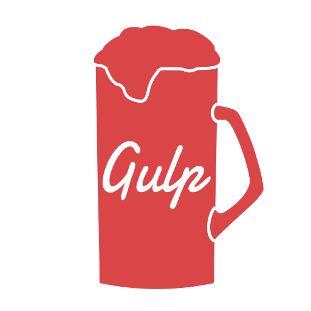

# Gulp Community Logo

## Meaning
The community logo is a beer mug. This image was chosen because beer thingy usually drunk when people get together in a pub. Which is a community in somewhat meaning it could offer, getting together. Another reason for a glass of beer is to inherit the original Gulp logo, a drinking cup. And finally, coding can be as addictive as drinking alcohol.

## Reference
Visit the origin repository (on Gitlab) for detail about what references were used to make the logo: [gitlab.com/ngdangtu/gulp-community-logo](https://gitlab.com/ngdangtu/gulp-community-logo/-/tree/main)
